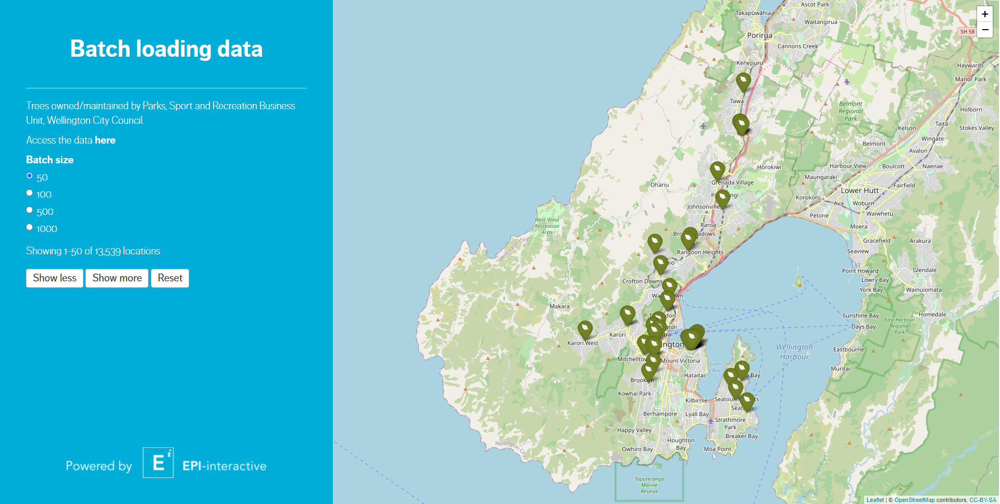

# Batch Loading

Efficiently presenting large amounts of data in a web application can be a challenge, especially when presenting spatial data which requires visualisation on a map. Rendering large amounts of data to a map can easily slow down an application and detract from the user experience.

One strategy we have to get around this is batch loading - splitting up the data into manageable chunks, then presenting these to the user one at a time. We provide the user with controls to choose the batch size, show more or less batches, and reset the visualisation to the first batch.

In this example, we use batch loading to present spatial data on trees managed by the Wellington City Council (13,539 records).

You can try out the app [here](https://github.com/epi-interactive/batch-loading "Link to shiny application demo on shiny.epi-interactive.com")



## How it works

In *server.R*, assign the following variables to keep track of the batches:

``` r
    currentBatches <- reactiveVal(1)
    batchSizes <- reactiveVal(numeric())
    maxBatches <- reactiveVal(1)

    maxShapes <- nrow(g_mainData)
```

-   *currentBatches* keeps track of how many batches have already been presented.

-   *batchSizes* keeps track of the cumulative number of records being shown as batches are presented.

-   *maxBatches* tracks the maximum number of batches available for the selected batch size.

-   *maxShapes* tracks the total number of records in the data

On application start & whenever the batch size changes, assign batch numbers to the data and update the maximum number of batches:

``` r
    batchSourceData <- reactive({}
        req(!is.null(input$batchSize))
        
        batchSize <- as.numeric(input$batchSize)
        
        out <- mainData() %>%
            mutate(batch = ((row_number()-1) %/% (batchSize)) + 1)
        
        maxBatches(length(unique(out$batch)))
        
        return(out)
    })
```

Define functionality for rendering & clearing one batch at a time. When rendering a new batch, update the *batchSizes* reactiveVal with the new batch size value. When clearing a batch, remove the last value from the *batchSizes* reactiveVal.

``` r
    renderBatch <- function(map, currentBatch) {
        
        # limit shapes to one specific batch
        currentBatchData <- batchSourceData() %>%
            filter(batch == currentBatch)
            
        if(currentBatch == 1) {
            batchSizes(isolate(input$batchSize))
        }
        else {
            batchSizesVar <- isolate(as.numeric(batchSizes()))
            lastBatchValue <- ifelse(length(batchSizesVar) == 0, 
                                     0, batchSizesVar[length(batchSizesVar)])
            batchSizes(c(batchSizesVar, lastBatchValue + nrow(currentBatchData)))
        }
        
        icons <- awesomeIcons(
            icon = 'leaf',
            iconColor = 'white',
            library = 'ion',
            markerColor = "darkgreen"
        )
            
        map <- map %>%
            addAwesomeMarkers(
                group = paste0("shapes", currentBatch),
                data = currentBatchData,
                layerId = ~OBJECTID,
                icon = icons,
                popup = ~popupText
            )
    }
    
    
    clearBatch <- function(map, keep) {

        for(batch in (keep+1):maxBatches()) {
            shapeGroupName <- paste0("shapes", batch)

            map <- map %>%
                clearGroup(shapeGroupName)
        }
        batchSizes(batchSizes()[1:keep])
    }
```

Create the base map and render the first batch by default:

``` r
    baseMap <- reactive({
        out <- leaflet(
            options = leafletOptions(
                minZoom = 3,
                zoomControl = FALSE
            )) %>%
            addTiles() %>%
            htmlwidgets::onRender("function(el, x) {
                L.control.zoom({ position: 'topright' }).addTo(this)
            }") %>%
            renderBatch(1)
        return(out)
    })
```

Observe the "Show more" and "Show less" buttons to trigger the batch changes and update the *currentBatches* reactiveVal. Use min / max to prevent the current batch \# from going out of bounds (less than 1 or greater than the *maxBatches* variable). If the batch number has changed, render the current batch or clear batches above the current batch.

``` r
    observeEvent(input$showMore, {

        current <- currentBatches()
        new <- min(current + 1, maxBatches())
        if(new != currentBatches()) {
            map <- leafletProxy("map")
            renderBatch(map, new)
            enable("showLess")
        }
        else {
            disable("showMore")
        }
        currentBatches(new)
    })


    observeEvent(input$showLess, {

        current <- currentBatches()
        new <- max(current - 1, 1)
        if(new != currentBatches()) {
            map <- leafletProxy("map")
            clearBatch(map, new)
            enable("showMore")
        }
        else {
            disable("showLess")
        }
        currentBatches(new)
    })
```

Observe the *batchSourceData* reactive to reset the batches if the batch size changes. Observe the reset button to reset the current batches without changing the batch size.

``` r
        observeEvent(batchSourceData(), {
            map <- leafletProxy("map")
            currentBatches(1)
            clearBatch(map, 0)
            renderBatch(map, 1)
            
        }, ignoreNULL = T, ignoreInit = T)
        
        
        observeEvent(input$reset, {
            map <- leafletProxy("map")
            clearBatch(map, 1)
            currentBatches(1)
            batchSizes(batchSizes()[1])
            
        })
```

Use a renderUI to reactively present the current batches status (I.e. how many records are being shown out of the total)

``` r
    output$currentBatchesText <- renderUI({
        div(style = "margin-bottom: 20px",
            paste0(
                "Showing ", 1, "-", format(batchSizes()[length(batchSizes())], big.mark = ","), 
                " of ", format(maxShapes, big.mark = ","), " locations"
            )
        )
    })
```

## Sources

-   [Wellington City Council "Trees" dataset](https://data-wcc.opendata.arcgis.com/datasets/WCC::wcc-trees/about)

------------------------------------------------------------------------

Code created by [Epi-interactive](https://www.epi-interactive.com/)

As always, our expert team is here to help if you want custom training, would like to take your dashboards to the next level or just need an urgent fix to keep things running. Just get in touch for a chat.

<https://www.epi-interactive.com/contact>
